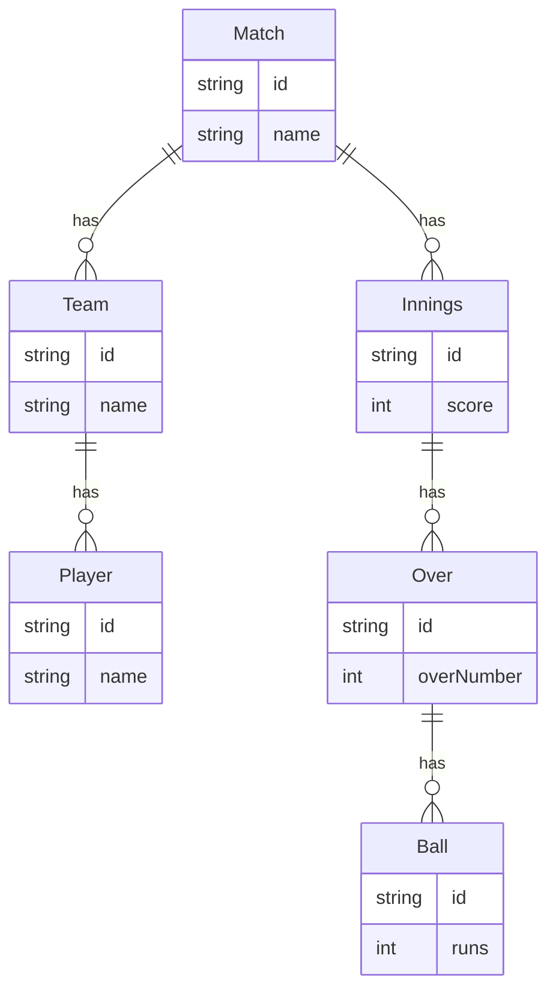

# Cricket Scorer Application - Technical Documentation

This document provides a comprehensive technical overview of the Cricket Scorer application, detailing its architecture, data flow, and implementation.

## 1. Tech Stack

- **Framework**: Next.js (App Router)
- **Language**: TypeScript
- **Styling**: Tailwind CSS
- **UI Components**: Shadcn UI
- **Database**: SQLite
- **ORM**: Prisma
- **AI Integration**: Genkit

## 2. Architecture Overview

The application follows a modern, full-stack architecture using Next.js, with a clear separation between the frontend and backend.

```mermaid
graph TD
    subgraph Browser (Client)
        A[React Components] --> B{User Interaction};
        B --> C[API Request (fetch)];
    end

    subgraph Server (Next.js)
        C --> D[API Routes];
        D --> E[Prisma Client];
        E --> F[SQLite Database];
        D --> G[Genkit Flows];
        G --> H[AI Model];
    end

    F --> E;
    E --> D;
    D --> C;
    C --> A;
```

-   **Frontend**: Built with React and Next.js, the frontend consists of interactive UI components that manage local state.
-   **Backend**: Next.js API Routes handle all backend logic, including data validation, database operations, and AI integration.
-   **Database**: A SQLite database is managed by the Prisma ORM, which provides a type-safe interface for data access.
-   **AI Services**: Genkit is used to create and manage AI flows for features like commentary generation and match simulation.

## 3. File-by-File Breakdown

-   `src/app/page.tsx`: The main entry point of the application, responsible for orchestrating the primary UI components.
-   `src/components/scoring-interface.tsx`: A stateful component that manages the real-time scoring of the match.
-   `src/components/scoreboard.tsx`: A presentational component that displays the current match score.
-   `src/lib/cricket-logic.ts`: A pure TypeScript module containing the core business logic for cricket scoring.
-   `src/app/api/players/route.ts`: An API route that handles all CRUD operations for players.
-   `prisma/schema.prisma`: The single source of truth for the database schema, defining all models and their relations.
-   `src/ai/flows/generate-match-commentary.ts`: A Genkit flow that defines the AI-powered commentary generation logic.

## 4. Database Schema (Detailed)

The database schema is defined in `prisma/schema.prisma`.



## 5. Features (Code-Level Deep Dive)

### 🏏 Match Scoring
1.  **UI Interaction**: The user clicks a button in `scoring-interface.tsx` to record a scoring event.
2.  **State Management**: The component's `onClick` handler updates its local state using React's `useState` hook.
3.  **Business Logic**: The handler calls a function from `src/lib/cricket-logic.ts` to compute the new score and update player statistics.
4.  **Data Persistence**: An API request is sent to a dedicated endpoint (e.g., `/api/matches/score`) to persist the updated match state to the database via Prisma.
5.  **UI Re-render**: The state change triggers a re-render of the `scoreboard.tsx` component, which receives the new data as props.

### 👥 Player Management
1.  **UI Interaction**: The user opens `manage-players-dialog.tsx` and submits the form to add a new player.
2.  **API Request**: The form's `onSubmit` handler constructs a request body and uses `fetch` to send a `POST` request to `/api/players`.
3.  **Backend Processing**: The `POST` function in `src/app/api/players/route.ts` receives the request and uses `prisma.player.create()` to insert a new record into the database.
4.  **UI Update**: The frontend receives the newly created player object, updates its local state, and re-renders the player list.

### 🤖 AI-Generated Commentary
1.  **UI Interaction**: The `commentary-generator.tsx` component periodically sends the current match state to a dedicated API endpoint.
2.  **Backend Processing**: The API route triggers the Genkit flow defined in `src/ai/flows/generate-match-commentary.ts`.
3.  **AI Integration**: The Genkit flow sends a request to a generative AI model, which returns the commentary text.
4.  **UI Update**: The commentary is streamed back to the UI and displayed in real-time.

## 6. Getting Started

### Prerequisites

-   Node.js (v18 or later)
-   pnpm

### Installation

1.  Clone the repository: `git clone <repository-url>`
2.  Install dependencies: `pnpm install`
3.  Initialize the database: `pnpm prisma migrate dev`

### Running the Development Server

```bash
pnpm run dev
```

## 7. Environment Variables

Create a `.env` file in the root of the project:

```
DATABASE_URL="file:./prisma/dev.db"
```

## 8. Deployment

This application is optimized for deployment on Vercel.
