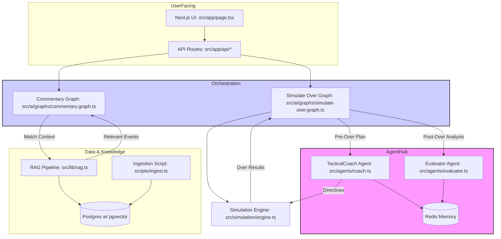

# Scorer-App – Advanced AI Integration Strategy
*(v2025-08-20, detailed implementation edition)*

> **Objective**: This document provides a granular, step-by-step technical guide for integrating a sophisticated AI ecosystem into the Scorer-App. It expands upon the initial blueprint, detailing the "how" and "why" for each component, from agentic control loops to RAG-powered commentary.

---

## 0. Project State & AI Vision

The application currently possesses a robust simulation core and a Genkit-based AI flow for basic tasks. The goal is to evolve this into a multi-layered AI system where:
- **Agentic AI** provides strategic oversight and analysis.
- **Generative AI** creates dynamic, context-aware content (commentary, insights).
- **LangGraph** orchestrates complex, stateful AI workflows.
- **RAG** grounds the AI in historical and real-time match data, ensuring relevance and accuracy.

---

## 1. Final Architecture with LangGraph

The architecture centralizes LangGraph as the primary orchestrator for complex AI tasks, integrating agents and RAG pipelines seamlessly.



---

## 2. Agentic-AI Layer: The Strategic Brain

**Concept**: We will implement two distinct agents that act as advisors and critics to the simulation engine, creating a self-correcting feedback loop. This moves beyond simple prediction to strategic planning and evaluation.

| File / Directory | Purpose & Implementation Details |
| :--- | :--- |
| `src/agents/` | **NEW FOLDER**. Will contain agent definitions. Each agent is a class or factory function wrapping a LangChain runnable with specific tools and memory. |
| `src/agents/coach.ts` | **`TacticalCoachAgent`**: Its goal is to devise an optimal strategy for the upcoming over. <br/>- **Input**: `MatchContext` (current score, batsmen, bowler, pitch conditions). <br/>- **Tools**: `getPlayerStats`, `getHeadToHeadRecord`. <br/>- **Output**: A JSON object like `{ "aggression": "high", "targetBowlerWeakness": "short_ball", "recommendedStrategy": "ai_offensive" }`. <br/>- **Memory**: Uses Redis-backed `ConversationBufferWindowMemory` to recall its own previous advice and its effect. |
| `src/agents/evaluator.ts` | **`EvaluatorAgent`**: Its goal is to assess the realism and quality of a simulated over's outcome. <br/>- **Input**: `MatchContext` before the over, `OverResult` after the over. <br/>- **Tools**: `getHistoricalOverOutcomes` (a RAG tool to find similar past overs). <br/>- **Output**: A score and critique: `{ "realismScore": 8.5, "critique": "The outcome is plausible, but the frequency of boundaries against this specific bowler is slightly higher than historical averages." }`. This data is logged for fine-tuning. |
| `src/simulation/engine.ts` | **Integration Point**: The engine will be modified to consult the agents via the LangGraph orchestrator. It won't call them directly. The graph will manage the state and agent invocations. |

### Code-Level Integration (`simulate-over.graph.ts`):
```typescript
// src/ai/graphs/simulate-over.graph.ts

// 1. Define Graph State
interface SimulationGraphState {
  context: MatchContext;
  overResult?: OverResult;
  tacticalPlan?: TacticalPlan;
  evaluation?: Evaluation;
}

// 2. Define Nodes
const tacticalCoachNode = async (state: SimulationGraphState) => {
  const plan = await tacticalCoachAgent.invoke({ context: state.context });
  return { tacticalPlan: plan };
};

const simulationNode = async (state: SimulationGraphState) => {
  // The engine is now a tool called by the graph
  const overResult = simulationEngine.runOver(state.context, state.tacticalPlan);
  return { overResult };
};

const evaluatorNode = async (state: SimulationGraphState) => {
  const evaluation = await evaluatorAgent.invoke({ 
    context: state.context, 
    result: state.overResult 
  });
  return { evaluation };
};

// 3. Wire up the graph
const workflow = new StateGraph<SimulationGraphState>({ channels: ... });
workflow.addNode("coach", tacticalCoachNode);
workflow.addNode("simulate", simulationNode);
workflow.addNode("evaluate", evaluatorNode);

workflow.setEntryPoint("coach");
workflow.addEdge("coach", "simulate");
workflow.addEdge("simulate", "evaluate");
workflow.addEdge("evaluate", END);

const simulationGraph = workflow.compile();
```

---

## 3. GenAI Layer: Dynamic Commentary & Voice

**Concept**: Move from static commentary templates to a dynamic, persona-driven system grounded in facts from our RAG pipeline. Add an audio layer for immersive experiences.

| Location | Modification Details |
| :--- | :--- |
| `src/ai/prompts/` | **NEW FOLDER**. Centralizes all system prompts. |
| `src/ai/prompts/commentary_system.md` | A detailed system prompt defining the AI's task, e.g., *"You are a world-class cricket commentator. Given the context of the match and a set of historical facts, generate exciting and insightful ball-by-ball commentary."* |
| `src/ai/prompts/personas/` | **NEW FOLDER**. Contains different commentator personas. e.g., `harsha_bhogle.md` ("Focus on elegant language and deep insights") or `danny_morrison.md` ("High energy, use quirky phrases"). The user can select a persona in the UI. |
| `src/app/api/speak/route.ts` | **Endpoint for Text-to-Speech**: <br/>1. Receives text content. <br/>2. Generates a unique hash of the text. <br/>3. Checks if an MP3 file with that hash exists in `public/audio/`. <br/>4. If not, calls a TTS provider (e.g., ElevenLabs, OpenAI TTS). <br/>5. Saves the MP3 and returns the public URL. This prevents re-generating audio for the same commentary text. |

---

## 4. LangGraph Orchestration: The Central Nervous System

**Concept**: Genkit flows are good for simple chains, but LangGraph is essential for the complex, stateful, and conditional logic our agents and advanced simulations require. It provides robustness, observability, and modularity.

| Path | Purpose & Graph Structure |
| :--- | :--- |
| `src/ai/graphs/simulate-over.graph.ts` | **Stateful Over Simulation**: This graph manages the entire lifecycle of simulating one over. <br/>- **State**: `(MatchContext, TacticalPlan, OverResult, Evaluation)` <br/>- **Nodes**: `TacticalCoach`, `RunSimulation`, `Evaluator`. <br/>- **Edges**: Linear sequence: `Coach -> Simulate -> Evaluate -> END`. This ensures strategy is decided *before* simulation and evaluation happens *after*. |
| `src/ai/graphs/commentary.graph.ts` | **RAG-Powered Commentary Generation**: This graph uses a critique-and-refine loop to produce high-quality commentary. <br/>- **State**: `(MatchContext, RetrievedFacts, DraftCommentary, FinalCommentary, Critique)` <br/>- **Nodes**: `RetrieveFacts` (calls RAG), `DraftCommentary` (initial LLM call), `CritiqueCommentary` (a separate LLM call checks for factual errors or blandness), `RefineCommentary`. <br/>- **Conditional Edges**: After `Critique`, the graph decides: if the critique is positive, go to `END`. If negative, go back to `RefineCommentary` with the critique as new input. This loop ensures quality. |
| `scripts/inspect-graphs.ts` | **NEW SCRIPT**: A development utility to visualize and debug the graphs. It will use `graph.getGraph().printMermaid()` to output diagrams, helping us understand the flow of logic. |

---

## 5. RAG Layer: Grounding AI in Reality

**Concept**: The LLM's knowledge is general. RAG provides specific, timely, and factual data from our own database, preventing hallucination and making outputs hyper-relevant.

| Prisma Model | DDL & Purpose |
| :--- | :--- |
| `MatchEventEmbedding` | `embedding vector(1536)`: Stores vector embeddings of significant match events. An "event" could be "Dhoni hits a six in the final over" or "Warne's ball of the century". This is our knowledge base. |
| `CommentaryFeedback` | `{ id, text, rating, contextJson }`: A table to store user feedback on generated commentary. A simple thumbs up/down rating on the UI will populate this table. This is crucial for future fine-tuning (RLHF). |

### Implementation Flow:
1.  **Setup pgvector**: Run a migration to add the vector extension to Postgres.
    ```bash
    pnpm prisma migrate dev --name add_pgvector_extension
    ```
2.  **Modify `prisma/schema.prisma`**: Add the new models and the `vector` type.
3.  **Create `scripts/ingest.ts`**:
    - Reads historical match data (e.g., from JSON files).
    - Chunks the data into meaningful `MatchEvent` documents. A good chunking strategy is per-over or per-wicket.
    - Uses an embedding model (e.g., OpenAI `text-embedding-3-small`) to convert each chunk into a vector.
    - Stores the original text and the vector in the `MatchEventEmbedding` table.
4.  **Implement `src/lib/rag.ts`**:
    ```typescript
    // src/lib/rag.ts
    import { OpenAIEmbeddings } from "@langchain/openai";
    import { PrismaVectorStore } from "@langchain/community/vectorstores/prisma";
    import { PrismaClient, MatchEventEmbedding } from "@prisma/client";

    const db = new PrismaClient();
    const embeddings = new OpenAIEmbeddings({ model: "text-embedding-3-small" });

    export const vectorStore = new PrismaVectorStore(db.matchEventEmbedding, {
      db,
      prisma: Prisma,
      vectorField: "embedding",
      sourceField: "text",
      embedding,
    });

    export async function getRelevantEvents(query: string, k: number = 5) {
      // This function is now a simple wrapper around the vector store retriever
      const retriever = vectorStore.asRetriever({ k });
      return await retriever.getRelevantDocuments(query);
    }
    ```

---

## 6. Phased Rollout & Dependencies

| Phase | Files to Modify/Create | Key Command / Action | Dependencies |
| :--- | :--- | :--- | :--- |
| **P0: Foundation** | `prisma/schema.prisma`, `package.json` | `pnpm prisma migrate dev` | `pgvector`, `langchain`, `@langchain/openai`, `@langchain/community`, `langgraph`, `redis` |
| **P1: RAG Pipeline** | `scripts/ingest.ts`, `src/lib/rag.ts`, `src/ai/graphs/commentary.graph.ts` | `pnpm tsx scripts/ingest.ts` | - |
| **P2: Agentic Loop** | `src/agents/*`, `src/ai/graphs/simulate-over.graph.ts` | `docker run -d -p 6379:6379 redis` | Redis server |
| **P3: UI & Voice** | `src/app/api/speak/route.ts`, `src/components/CommentaryPanel.tsx` | Add `ELEVENLABS_API_KEY` to `.env` | `elevenlabs-node` |

This detailed plan provides a clear path forward for each AI component, ensuring a modular, observable, and powerful integration.

---

## 7. Implementation Deep Dive: Code-Level Changes

This section contains the specific code to be added or modified in each file.

### Phase 0: Foundation

#### `package.json` (Dependency Additions)

Run the following command to add the necessary libraries for LangChain, LangGraph, OpenAI, and Redis:

```bash
pnpm add langchain @langchain/openai @langchain/community langgraph redis
```

#### `prisma/schema.prisma` (Changes)

The provider is switched to `postgresql` to support `pgvector`, and two new models, `MatchEventEmbedding` and `CommentaryFeedback`, are added for the RAG pipeline.

```prisma
// prisma/schema.prisma

generator client {
  provider        = "prisma-client-js"
  previewFeatures = ["extendedWhereUnique"]
}

datasource db {
  provider = "postgresql"
  url      = env("DATABASE_URL")
}

// ... (existing models remain unchanged) ...

model PlayerStats {
  id             Int     @id @default(autoincrement())
  match          Match   @relation(fields: [matchId], references: [id])
  matchId        Int
  player         Player  @relation(fields: [playerId], references: [id])
  playerId       Int
  team           Team    @relation(fields: [teamId], references: [id])
  teamId         Int
  runs           Int
  ballsFaced     Int
  fours          Int
  sixes          Int
  wickets        Int
  ballsBowled    Int
  maidens        Int
  runsConceded   Int
  economyRate    Float
  strikeRate     Float
  isSubstitute   Boolean
  isImpactPlayer Boolean
}

model MatchEventEmbedding {
  id        String @id @default(cuid())
  text      String
  embedding Unsupported("vector(1536)")

  @@index([embedding], map: "embedding_idx", type: Ivfflat)
}

model CommentaryFeedback {
  id          String   @id @default(cuid())
  text        String
  rating      Int
  contextJson String
  createdAt   DateTime @default(now())
}
```

After saving the schema, run the migration:
```bash
pnpm prisma migrate dev --name add_pgvector_and_rag_models
```

### Phase 1: RAG Pipeline

#### `scripts/ingest.ts` (New File)

This script will contain the logic to process historical data, generate embeddings, and populate the vector store.

```typescript
// scripts/ingest.ts

import { PrismaClient } from '@prisma/client';
import { OpenAIEmbeddings } from '@langchain/openai';
import { Document } from 'langchain/document';
import { PrismaVectorStore } from '@langchain/community/vectorstores/prisma';

const prisma = new PrismaClient();
const embeddings = new OpenAIEmbeddings({ model: 'text-embedding-3-small' });

// Sample historical data (replace with actual data source)
const historicalEvents = [
  "In the 2011 World Cup final, MS Dhoni hit a massive six to win the match for India.",
  "Anil Kumble took 10 wickets in a single innings against Pakistan in 1999.",
  "Yuvraj Singh hit six sixes in an over against England in the 2007 T20 World Cup.",
  "Sachin Tendulkar scored the first-ever double century in ODIs against South Africa in 2010."
];

async function main() {
  console.log('Starting ingestion...');

  const documents = historicalEvents.map(event => new Document({ pageContent: event }));

  await PrismaVectorStore.fromDocuments(
    documents,
    embeddings,
    {
      db: prisma,
      prisma: Prisma,
      tableName: 'MatchEventEmbedding',
      vectorColumnName: 'embedding',
      columns: {
        id: PrismaVectorStore.IdColumn,
        content: PrismaVectorStore.ContentColumn,
      },
    }
  );

  console.log('Ingestion complete!');
}

main()
  .catch(e => {
    console.error(e);
    process.exit(1);
  })
  .finally(async () => {
    await prisma.$disconnect();
  });
```

#### `src/lib/rag.ts` (New File)

This file will provide a simple interface for querying the vector store.

```typescript
// src/lib/rag.ts

import { PrismaClient } from '@prisma/client';
import { OpenAIEmbeddings } from '@langchain/openai';
import { PrismaVectorStore } from '@langchain/community/vectorstores/prisma';

const prisma = new PrismaClient();
const embeddings = new OpenAIEmbeddings({ model: 'text-embedding-3-small' });

export const vectorStore = new PrismaVectorStore(prisma.matchEventEmbedding, {
  db: prisma,
  prisma: Prisma,
  vectorField: 'embedding',
  sourceField: 'text',
  embedding,
});

export async function getRelevantEvents(query: string, k: number = 5) {
  const retriever = vectorStore.asRetriever({ k });
  const results = await retriever.getRelevantDocuments(query);
  return results.map(doc => doc.pageContent);
}
```

### Phase 2: Agentic Loop & Orchestration

#### `src/agents/coach.ts` (New File)

The `TacticalCoachAgent` analyzes the match context and recommends a strategy for the upcoming over. It uses tools to fetch player data and maintains a short-term memory of its previous decisions.

```typescript
// src/agents/coach.ts

import { ChatOpenAI } from '@langchain/openai';
import { ChatPromptTemplate } from '@langchain/core/prompts';
import { createOpenAIFunctionsAgent, AgentExecutor } from 'langchain/agents';
import { createRetrieverTool } from 'langchain/tools/retriever';
import { RedisChatMessageHistory } from '@langchain/community/stores/message/redis';
import { RunnableWithMessageHistory } from '@langchain/core/runnables';
import { vectorStore } from '@/lib/rag'; // Assuming RAG setup provides a retriever for player stats

const llm = new ChatOpenAI({ model: 'gpt-4o' });

const prompt = ChatPromptTemplate.fromMessages([
  ['system', `You are a world-class cricket strategist. Your goal is to analyze the current match situation and devise a tactical plan for the next over.
   Consider the strengths and weaknesses of the batsmen and the bowler, the pitch conditions, and the overall match pressure.
   Output a JSON object with your recommended 'aggression' level (low, medium, high), 'targetBowlerWeakness', and 'recommendedStrategy'.`],
  ['human', `{input}`],
  ['placeholder', '{agent_scratchpad}'],
]);

// In a real scenario, you would have tools to get live player stats.
// Here, we use our RAG retriever as a stand-in for fetching player data.
const playerStatsRetriever = vectorStore.asRetriever();
const tools = [
  createRetrieverTool(playerStatsRetriever, {
    name: 'getPlayerStats',
    description: 'Searches for historical stats and performance data for a player.',
  }),
];

const agent = createOpenAIFunctionsAgent({ llm, tools, prompt });
const agentExecutor = new AgentExecutor({ agent, tools });

export const tacticalCoachAgent = new RunnableWithMessageHistory({
  runnable: agentExecutor,
  getMessageHistory: (sessionId) =>
    new RedisChatMessageHistory({
      sessionId,
      url: process.env.REDIS_URL || 'redis://localhost:6379',
    }),
  inputMessagesKey: 'input',
  historyMessagesKey: 'chat_history',
});
```

#### `src/agents/evaluator.ts` (New File)

The `EvaluatorAgent` assesses the realism of a simulated over by comparing it to historical data.

```typescript
// src/agents/evaluator.ts

import { ChatOpenAI } from '@langchain/openai';
import { ChatPromptTemplate } from '@langchain/core/prompts';
import { JsonOutputFunctionsParser } from 'langchain/output_parsers/openai_functions';

const llm = new ChatOpenAI({ model: 'gpt-4o' });

const prompt = ChatPromptTemplate.fromMessages([
  ['system', `You are a cricket analyst. Your task is to evaluate the realism of a simulated cricket over.
   Given the context before the over and the results of the over, provide a 'realismScore' from 1 to 10 and a brief 'critique'.
   Base your critique on historical context and player styles.`],
  ['human', `Context: {context}\n\nOver Result: {result}`],
]);

const functionCallingModel = llm.bind({
  functions: [
    {
      name: 'evaluationOutput',
      description: 'Formats the evaluation output.',
      parameters: {
        type: 'object',
        properties: {
          realismScore: { type: 'number', description: 'The realism score from 1-10.' },
          critique: { type: 'string', description: 'A brief analysis of the over.' },
        },
        required: ['realismScore', 'critique'],
      },
    },
  ],
  function_call: { name: 'evaluationOutput' },
});

export const evaluatorAgent = prompt.pipe(functionCallingModel).pipe(new JsonOutputFunctionsParser());
```

#### `src/ai/graphs/simulate-over.graph.ts` (New File)

This LangGraph workflow orchestrates the agents and the simulation engine to simulate a single over with strategic oversight.

```typescript
// src/ai/graphs/simulate-over.graph.ts

import { StateGraph, END } from '@langchain/langgraph';
import { tacticalCoachAgent } from '@/agents/coach';
import { evaluatorAgent } from '@/agents/evaluator';
import { simulationEngine } from '@/simulation/engine'; // Assuming engine is importable

interface SimulationGraphState {
  context: any; // Replace with actual MatchContext type
  overResult?: any; // Replace with actual OverResult type
  tacticalPlan?: any;
  evaluation?: any;
  sessionId: string;
}

const coachNode = async (state: SimulationGraphState) => {
  const plan = await tacticalCoachAgent.invoke(
    { input: `Analyze this situation: ${JSON.stringify(state.context)}` },
    { configurable: { sessionId: state.sessionId } }
  );
  return { tacticalPlan: plan.output };
};

const simulationNode = async (state: SimulationGraphState) => {
  const overResult = simulationEngine.runOver(state.context, state.tacticalPlan);
  return { overResult };
};

const evaluatorNode = async (state: SimulationGraphState) => {
  const evaluation = await evaluatorAgent.invoke({
    context: state.context,
    result: state.overResult,
  });
  return { evaluation };
};

const workflow = new StateGraph<SimulationGraphState>({
  channels: {
    context: null,
    overResult: null,
    tacticalPlan: null,
    evaluation: null,
    sessionId: null,
  },
});

workflow.addNode('coach', coachNode);
workflow.addNode('simulate', simulationNode);
workflow.addNode('evaluate', evaluatorNode);

workflow.setEntryPoint('coach');
workflow.addEdge('coach', 'simulate');
workflow.addEdge('simulate', 'evaluate');
workflow.addEdge('evaluate', END);

export const simulationGraph = workflow.compile();
```
